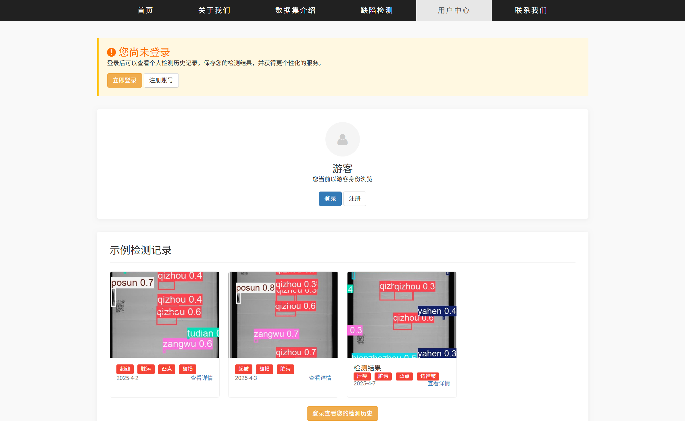

# Battery-surface-defect-detection

2024年四川大学大创项目————识痕——基于深度学习的锂电池表面缺陷高效标注及智能检测系统

#### 项目简介

锂电池作为众多战略性新兴产业的基石，是推动清洁能源转型、智能制造和新兴交通体系发展的重要支柱。目前，锂电池的生产加工基本实现了全流程自动化，但在流水线生产过程中，机器损伤、组件碰撞等因素可能导致表面划痕、破损、凹坑甚至更严重的漏铝、漏液缺陷。这些缺陷不仅影响锂电池的外观，还可能损害其内部结构，导致性能降低甚至引发爆炸等安全隐患。基于此，本项目提出了一种获取适配缺陷检测任务预训练权重-聚类以构建高效标注标准-基于 YOLOv8 改进算法的一体化解决方案。

#### 研究过程

#### 网站向导
我们采用 **Vue.js** 构建响应式前端界面，通过 **Axios** 与后端 **Flask RESTful API** 进行数据交互，实现高效的异步通信；后端使用 **Flask** 框架搭建轻量级服务，结合 **MongoDB** 非关系型数据库存储和管理数据，最终构建了一个高性能、易扩展的全栈 Web 应用。

  
  
  
  
  
  
  
  

#### 技术细节

- 通过基于全卷积自编码器和软聚类算法的自动标注方法，项目大幅提高了缺陷标注的效率和一致性，帮助专家快速制定标准化标注体系，从而为后续的模型训练损供高质量的数据支持。
- 结合自监督学习方法 (SimCLR)，项目通过定制预训练权重，优化了模型对微小缺陷和复杂背景的识别能力，尤其在小样本和小目标缺陷的检测场景下表理突出，提升了模型的泛化能力和鲁棒性。
- 通过改进YOLOV8模型，项目解决了小目标、极端长宽比和小样本问题，增强了模型对锂电池表面缺陷的检測持度和鲁棒性。引入FPN注意模块、非对称卷积等创新技术，有效提升了在复杂工业场景中的检测性能。

#### 参考文献

[1]Xue Y, Zhang G, Li W, Wang X, Zhou Y, Yan J. "H2RBOX: Horizontal BoxAnnotation is All You Need for Oriented Object Detection." In Proceedings ofthe International Conference on Learning Representations (ICLR), 2023. 

[2] YOLOv8: A Novel Object Detection Algorithm with Enhanced Performanceand Robustness. In Proceedings of the IEEE Conference, Chennai, India, 2024, pp. 1-6. doi: 10.1109/ACCESS.2024.DOI.10533619. 

[3] Cong W, Cong Y, Liu Y, Sun G. "Cs 2K: Class-specific and Class-sharedKnowledge Guidance for Incremental Semantic Segmentation." arXivpreprint arXiv:2407.09047, 2024.Bochkovskiy, A., Wang, C.-Y., & Liao, H.-Y. M. (2020). YOLOv4: Optimalspeed and accuracy of object detection. arXiv preprint arXiv:2004.10934. 

[4] Wang, C.-Y., et al. (2023). YOLOv8 multi-task version A-YOLOM. https://github.com/JiayuanWang-JW/YOLOv8-multi-task. 

[5] Li, C., Li, L., Jiang, H., Weng, K., Geng, Y., Li, L., Ke, Z., Li, Q., et al.  (2022). YOLOv6: A Single-Stage Object Detection Framework for Industrial Applications. arXiv preprint arXiv:2209.02976. 

[6]Wang, C.-Y., & Liao, H.-Y. M. (2024). YOLOv1 to YOLOv10: The fastest and most accurate real-time object detection systems. IEEE/CVF Conferenceon Computer Vision and Pattern Recognition (CVPR)

